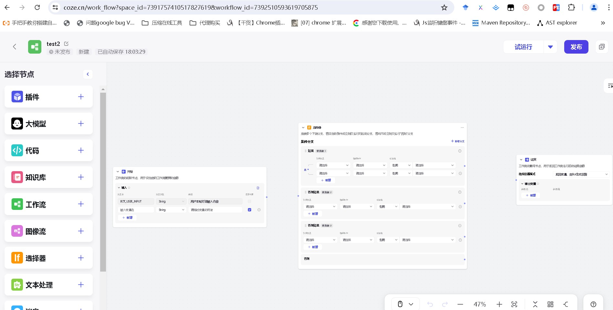

# coze-flow-test

#### Introduction
This project is a reimplementation of the Coze workflow and involves technologies such as Vue 3 + Vue-Flow + TypeScript + Sass + Mitt + dragabble features of H5 + Element-Plus UI.

#### Software Architecture
This software architecture is a dragabble workflow based on ByteDance's technology stack, imitating the Coze workflow.

[coze workflow](https://www.coze.cn/work_flow)
Screenshot of the official website of the Coze workflow in 2024
.

#### Installation Tutorial
- pnpm 9.3 pnpm install
- pnpm dev

#### Disclaimer
Icons and styles are for reference only and the choice of the technical stack is a personal decision.
The technical stack is different from that of Coze, which uses React + Semi-Design, while this project uses Vue3 + Element-Plus.

Note: This project is an open-source project. If you believe that I have violated your rights and interests, please contact me at 2522202958@qq.com (Xinhong Wang),
and I will delete this project immediately.

