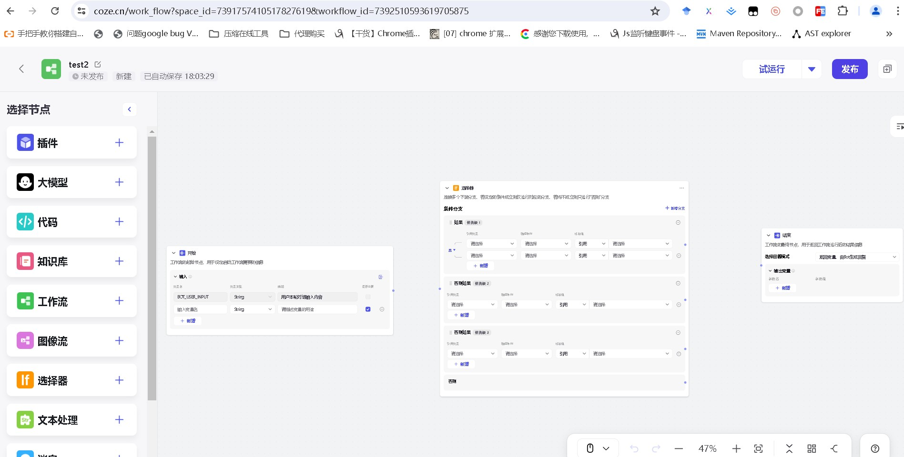

# coze-flow-test

## 介绍
本项目是对coze工作流的仿写，涉及的技术包括vue3、vue-flow、ts、sass、mitt、h5的可拖拽特性以及element-plus UI。

## 软件架构
该软件架构是对coze工作流的仿写，是一个基于字节跳动技术栈的可拖拽工作流。
仿写[coze工作流](https://www.coze.cn/work_flow) 可拖拽工作流（字节跳动）

coze 工作流 官网截图，2024年版本

## 安装教程
1. 安装pnpm：pnpm install
2. 安装依赖：pnpm 9.3 pnpm install
3. 启动开发服务器：pnpm dev

## 声明
1. 图标、样式等参考coze官网，技术栈选择是个人抉择。
2. 技术栈与coze不同，coze使用的是react+semi-design，本人使用的是vue3+element-plus。

## 注意事项
这是一个开源项目，如果您认为我有侵权行为，请联系我 2522202958@qq.com（xinhong.wang），我会立即删除该项目。

